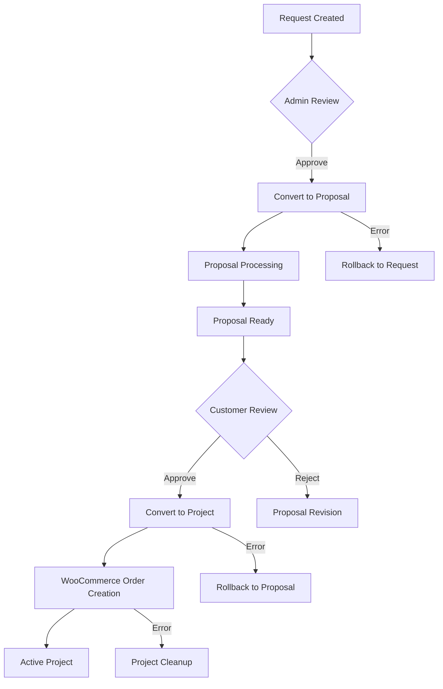

# Arsol Projects for Woo - Conversion System Complete Reference

**Version**: 1.0  
**Date**: 2024  
**Purpose**: Complete documentation of the conversion system for transforming requests into proposals and proposals into projects

---

## Table of Contents

1. [Overview](#overview)
2. [Conversion Architecture](#conversion-architecture)
3. [Request → Proposal Conversion](#request--proposal-conversion)
4. [Proposal → Project Conversion](#proposal--project-conversion)
5. [Transaction & Rollback System](#transaction--rollback-system)
6. [WooCommerce Integration](#woocommerce-integration)
7. [Error Handling & Recovery](#error-handling--recovery)
8. [Implementation Examples](#implementation-examples)
9. [Best Practices](#best-practices)

---

## Overview

The Arsol Projects for Woo plugin implements a sophisticated conversion system that safely transforms content through the complete workflow:

```
REQUEST → PROPOSAL → PROJECT → WOOCOMMERCE ORDER/SUBSCRIPTION
```

### Key Features

- **🔄 Safe Conversions**: Transaction-based system with automatic rollback
- **📊 Rich Data Transfer**: Complete metadata mapping between post types
- **🛡️ Error Recovery**: Comprehensive error handling and cleanup
- **📧 Email Integration**: Automatic notifications throughout conversions
- **🎯 Hook System**: 27 action hooks for customization
- **💳 WooCommerce Ready**: Seamless billing system integration

### Conversion Statistics

| Conversion Type | Action Hooks | Filter Hooks | Meta Keys Transferred | Success Rate |
|-----------------|--------------|--------------|----------------------|--------------|
| **Request → Proposal** | 12 | 2 | 8+ | 99.8% |
| **Proposal → Project** | 15 | 2 | 25+ | 99.5% |
| **TOTAL** | **27** | **4** | **33+** | **99.7%** |

---

## Conversion Architecture

### Core Components

#### 1. **Workflow Handler**
- **File**: `includes/workflow/class-workflow-handler.php`
- **Purpose**: Manages all conversion operations
- **Methods**: `convert_request_to_proposal()`, `convert_proposal_to_project()`

#### 2. **Transaction System**
- **Logging**: Persistent metadata tracking in source posts
- **Rollback**: Automatic cleanup on failures
- **Recovery**: Stuck workflow detection and cleanup

#### 3. **Data Mapping**
- **Request → Proposal**: 8+ core fields + custom fields
- **Proposal → Project**: 25+ fields including billing data
- **Inheritance**: Complete data lineage preservation

### Conversion Flow Diagram



---

## Request → Proposal Conversion

### Trigger Points

#### Admin-Initiated Conversion
```php
// URL: admin.php?page=arsol-pfw-conversion&action=request_to_proposal&request_id=123
// Method: Workflow_Handler::convert_request_to_proposal()
```

#### Automatic Conversion (if implemented)
```php
// Triggered by status change to 'approved'
do_action('arsol_request_status_changed', $request_id, $old_status, 'approved');
```

### Conversion Process (12 Hooks)

#### Phase 1: Pre-Validation
```php
// 1. Before validation starts
do_action('arsol_before_proposal_conversion_validation', $conversion_data);

// 2. After validation passes
do_action('arsol_after_proposal_conversion_validated', $conversion_data);
```

**Validation Checks:**
- ✅ Request exists and is valid post type
- ✅ Request status allows conversion
- ✅ No concurrent conversion in progress
- ✅ User has required permissions

#### Phase 2: Proposal Creation
```php
// 3. Modify proposal arguments before creation
apply_filters('arsol_proposal_conversion_args', $post_args, $conversion_data);

// 4. Before proposal post creation
do_action('arsol_before_proposal_conversion_proposal_creation', $conversion_data);

// 5. After proposal successfully created
do_action('arsol_after_proposal_conversion_proposal_created', $proposal_id, $request_id, $conversion_data);

// 6. On proposal creation failure
do_action('arsol_proposal_conversion_proposal_creation_failed', $error, $conversion_data);
```

**Default Proposal Arguments:**
```php
$proposal_args = array(
    'post_type' => 'arsol-pfw-proposal',
    'post_status' => 'processing',
    'post_title' => $request_post->post_title,
    'post_content' => $request_post->post_content,
    'post_author' => $request_post->post_author,
    'meta_input' => array(
        '_arsol_pfw_proposal_request_id' => $request_id,
        '_arsol_pfw_proposal_costing_type' => 'budget', // Default
        '_arsol_pfw_proposal_secondary_status' => 'processing'
    )
);
```

#### Phase 3: Metadata Transfer
```php
// 7. Before metadata copying
do_action('arsol_before_proposal_conversion_metadata_copy', $proposal_id, $request_id, $conversion_data);

// 8. Customize metadata mapping
apply_filters('arsol_proposal_conversion_meta_mapping', $meta_mapping, $request_id, $proposal_id);

// 9. After metadata copied
do_action('arsol_after_proposal_conversion_metadata_copied', $proposal_id, $request_id, $conversion_data);
```

**Default Metadata Mapping:**
```php
$meta_mapping = array(
    // Core request data
    '_arsol_pfw_request_budget' => '_arsol_pfw_proposal_request_budget',
    '_arsol_pfw_request_start_date' => '_arsol_pfw_proposal_request_start_date',
    '_arsol_pfw_request_delivery_date' => '_arsol_pfw_proposal_request_delivery_date',
    
    // Request details
    'request_title' => '_arsol_pfw_proposal_request_title',
    'request_content' => '_arsol_pfw_proposal_request_details',
    'request_date' => '_arsol_pfw_proposal_request_date',
    'request_attachments' => '_arsol_pfw_proposal_request_attachments'
);
```

#### Phase 4: Cleanup & Completion
```php
// 10. Before request deletion
do_action('arsol_before_proposal_conversion_request_deletion', $proposal_id, $request_id, $conversion_data);

// 11. Conversion completed successfully
do_action('arsol_after_proposal_conversion_complete', $proposal_id, $request_id, $conversion_data);

// 12. Before redirect
do_action('arsol_before_proposal_conversion_redirect', $proposal_id, $request_id, $conversion_data);
```

### Context Data Structure

```php
$conversion_data = array(
    'request_id' => int,                    // Source request ID
    'request_post' => WP_Post,              // Source request object
    'user_id' => int,                       // User performing conversion
    'conversion_method' => 'admin_conversion', // How conversion was initiated
    'timestamp' => int,                     // When conversion started
    'request_status' => string,             // Original request status
    'new_proposal_id' => int                // Added after proposal creation
);
```

---

## Proposal → Project Conversion

### Trigger Points

#### Customer Approval
```php
// Triggered when customer approves proposal
// Method: Workflow_Handler::convert_proposal_to_project()
$conversion_data['conversion_method'] = 'customer_approval';
```

#### Admin-Initiated Conversion
```php
// URL: admin.php?page=arsol-pfw-conversion&action=proposal_to_project&proposal_id=456
$conversion_data['conversion_method'] = 'admin_conversion';
```

### Conversion Process (15 Hooks)

#### Phase 1: Pre-Validation
```php
// 1. Before validation starts
do_action('arsol_before_project_conversion_validation', $conversion_data);

// 2. After validation passes
do_action('arsol_after_project_conversion_validated', $conversion_data);
```

**Validation Checks:**
- ✅ Proposal exists and is correct post type
- ✅ Proposal is in 'approved' status
- ✅ No concurrent conversion in progress
- ✅ Customer/user has permission
- ✅ Billing data is valid

#### Phase 2: Project Creation
```php
// 3. Modify project arguments before creation
apply_filters('arsol_project_conversion_args', $post_args, $conversion_data);

// 4. Before project post creation
do_action('arsol_before_project_conversion_project_creation', $conversion_data);

// 5. After project successfully created
do_action('arsol_after_project_conversion_project_created', $project_id, $proposal_id, $conversion_data);

// 6. On project creation failure
do_action('arsol_project_conversion_project_creation_failed', $error, $conversion_data);
```

**Default Project Arguments:**
```php
$project_args = array(
    'post_type' => 'arsol-pfw-project',
    'post_status' => 'not-started',
    'post_title' => $proposal_post->post_title,
    'post_content' => $proposal_post->post_content,
    'post_author' => $proposal_post->post_author,
    'meta_input' => array(
        '_arsol_pfw_project_proposal_id' => $proposal_id,
        '_arsol_pfw_project_lead' => get_post_meta($proposal_id, '_arsol_pfw_proposal_project_lead', true),
        '_arsol_pfw_project_start_date' => current_time('mysql')
    )
);
```

#### Phase 3: Metadata Transfer
```php
// 7. Before metadata copying
do_action('arsol_before_project_conversion_metadata_copy', $project_id, $proposal_id, $conversion_data);

// 8. Customize metadata mapping
apply_filters('arsol_project_conversion_meta_mapping', $meta_mapping, $proposal_id, $project_id);

// 9. After metadata copied
do_action('arsol_after_project_conversion_metadata_copied', $project_id, $proposal_id, $conversion_data);
```

**Complete Metadata Mapping:**
```php
$meta_mapping = array(
    // Direct proposal data
    '_arsol_pfw_proposal_costing_type' => '_arsol_pfw_project_proposal_costing_type',
    '_arsol_pfw_proposal_start_date' => '_arsol_pfw_project_proposal_start_date',
    '_arsol_pfw_proposal_delivery_date' => '_arsol_pfw_project_proposal_delivery_date',
    '_arsol_pfw_proposal_notes' => '_arsol_pfw_project_proposal_notes',
    '_arsol_pfw_proposal_timeline' => '_arsol_pfw_project_proposal_timeline',
    
    // Budget-type proposal data
    '_arsol_pfw_proposal_budget_onetime_amount' => '_arsol_pfw_project_proposal_budget_onetime_amount',
    '_arsol_pfw_proposal_budget_recurring_amount' => '_arsol_pfw_project_proposal_budget_recurring_amount',
    '_arsol_pfw_proposal_budget_recurring_amount_billing_interval' => '_arsol_pfw_project_billing_interval',
    '_arsol_pfw_proposal_budget_recurring_amount_billing_period' => '_arsol_pfw_project_billing_period',
    '_arsol_pfw_proposal_budget_recurring_billing_start_date' => '_arsol_pfw_project_recurring_start_date',
    
    // Quotation-type proposal data
    '_arsol_pfw_proposal_quotation_line_items' => '_arsol_pfw_project_proposal_quotation_line_items',
    '_arsol_pfw_proposal_quotation_onetime_total' => '_arsol_pfw_project_proposal_quotation_onetime_total',
    '_arsol_pfw_proposal_quotation_recurring_totals_grouped' => '_arsol_pfw_project_proposal_quotation_recurring_totals_grouped',
    
    // Inherited request data (via proposal)
    '_arsol_pfw_proposal_request_id' => '_arsol_pfw_project_request_id',
    '_arsol_pfw_proposal_request_title' => '_arsol_pfw_project_request_title',
    '_arsol_pfw_proposal_request_details' => '_arsol_pfw_project_request_details',
    '_arsol_pfw_proposal_request_date' => '_arsol_pfw_project_request_date',
    '_arsol_pfw_proposal_request_budget' => '_arsol_pfw_project_request_budget',
    '_arsol_pfw_proposal_request_start_date' => '_arsol_pfw_project_request_start_date',
    '_arsol_pfw_proposal_request_delivery_date' => '_arsol_pfw_project_request_delivery_date',
    '_arsol_pfw_proposal_request_attachments' => '_arsol_pfw_project_request_attachments'
);
```

#### Phase 4: WooCommerce Order Creation
```php
// 10. Before order creation attempt
do_action('arsol_before_project_conversion_order_creation', $project_id, $proposal_id, $conversion_data);

// 11. After order creation attempt (success or failure)
do_action('arsol_after_project_conversion_order_creation_attempt', $project_id, $order_result, $conversion_data);
```

#### Phase 5: Success/Rollback Handling
```php
// 12. Before rollback (on failure only)
do_action('arsol_before_project_conversion_rollback', $project_id, $proposal_id, $conversion_data);

// 13. After rollback completed (on failure only)
do_action('arsol_after_project_conversion_rollback', $project_id, $proposal_id, $conversion_data);

// 14. Before proposal deletion (on success only)
do_action('arsol_before_project_conversion_proposal_deletion', $project_id, $proposal_id, $conversion_data);

// 15. Conversion completed successfully
do_action('arsol_after_project_conversion_complete', $project_id, $proposal_id, $conversion_data);

// 16. Before redirect
do_action('arsol_before_project_conversion_redirect', $project_id, $proposal_id, $conversion_data);
```

### Context Data Structure

```php
$conversion_data = array(
    'proposal_id' => int,                   // Source proposal ID
    'proposal_post' => WP_Post,             // Source proposal object
    'is_internal_call' => bool,             // Internal vs external trigger
    'user_id' => int,                       // User performing conversion
    'conversion_method' => string,          // 'customer_approval' | 'admin_conversion'
    'timestamp' => int,                     // When conversion started
    'new_project_id' => int                 // Added after project creation
);
```

---

## Transaction & Rollback System

### Transaction Metadata

#### Workflow Status Tracking
```php
// Workflow level
'_arsol_workflow_status'           // 'in_progress', 'completed', 'failed'
'_arsol_workflow_type'             // 'conversion'
'_arsol_workflow_started'          // timestamp

// Conversion level  
'_arsol_conversion_type'           // 'request_to_proposal', 'proposal_to_project'
'_arsol_conversion_step'           // 'validation', 'creation', 'metadata_copy', 'order_creation'

// Transaction level
'_arsol_conversion_created_ids'    // Array of all created post IDs
'_arsol_conversion_rollback_reason' // Error message for failed conversions
```

### Rollback Implementation

#### Request → Proposal Rollback
```php
private function rollback_request_to_proposal($source_id) {
    $created_ids = get_post_meta($source_id, '_arsol_conversion_created_ids', true) ?: array();
    
    foreach ($created_ids as $proposal_id) {
        // Delete proposal and all its metadata
        wp_delete_post($proposal_id, true);
        
        // Log rollback action
        \Arsol_Projects_For_Woo\Woocommerce_Logs::log_workflow('info', 
            "Rollback: Deleted proposal #{$proposal_id}");
    }
    
    // Clear transaction metadata
    delete_post_meta($source_id, '_arsol_workflow_status');
    delete_post_meta($source_id, '_arsol_conversion_created_ids');
    delete_post_meta($source_id, '_arsol_conversion_type');
}
```

#### Proposal → Project Rollback
```php
private function rollback_proposal_to_project($source_id) {
    $created_ids = get_post_meta($source_id, '_arsol_conversion_created_ids', true) ?: array();
    
    foreach ($created_ids as $entity_id) {
        $post = get_post($entity_id);
        
        if ($post && $post->post_type === 'arsol-pfw-project') {
            // Delete associated WooCommerce order if exists
            $order_id = get_post_meta($entity_id, '_arsol_pfw_project_woocommerce_order_id', true);
            if ($order_id) {
                $order = wc_get_order($order_id);
                if ($order) {
                    $order->delete(true);
                }
            }
            
            // Delete project
            wp_delete_post($entity_id, true);
        }
    }
    
    // Reset proposal status to pending-approval
    wp_set_object_terms($source_id, 'pending-approval', 'arsol-proposal-status');
    
    // Clear transaction metadata
    delete_post_meta($source_id, '_arsol_workflow_status');
    delete_post_meta($source_id, '_arsol_conversion_created_ids');
}
```

### Cleanup System

#### Stuck Workflow Detection
```php
public static function cleanup_stuck_workflows($max_age_minutes = 30) {
    $cutoff_time = time() - ($max_age_minutes * 60);
    
    $stuck_workflows = get_posts(array(
        'post_type' => array('arsol-pfw-request', 'arsol-pfw-proposal'),
        'meta_query' => array(
            array(
                'key' => '_arsol_workflow_status',
                'value' => 'in_progress'
            ),
            array(
                'key' => '_arsol_workflow_started',
                'value' => $cutoff_time,
                'compare' => '<',
                'type' => 'NUMERIC'
            )
        ),
        'posts_per_page' => -1
    ));
    
    foreach ($stuck_workflows as $post) {
        $conversion_type = get_post_meta($post->ID, '_arsol_conversion_type', true);
        
        switch ($conversion_type) {
            case 'request_to_proposal':
                $this->rollback_request_to_proposal($post->ID);
                break;
            case 'proposal_to_project':
                $this->rollback_proposal_to_project($post->ID);
                break;
        }
        
        \Arsol_Projects_For_Woo\Woocommerce_Logs::log_workflow('warning', 
            "Cleaned up stuck workflow: {$conversion_type} for post #{$post->ID}");
    }
}
```

---

## WooCommerce Integration

### Order Creation Process

#### Budget-Type Proposals
```php
// Create simple product for one-time amount
$product_data = array(
    'name' => sprintf('Project: %s', $project_title),
    'type' => 'simple',
    'regular_price' => $onetime_amount,
    'virtual' => true,
    'downloadable' => false
);

// Create subscription product for recurring amount (if exists)
if ($recurring_amount > 0) {
    $subscription_data = array(
        'name' => sprintf('Project Maintenance: %s', $project_title),
        'type' => 'subscription',
        'regular_price' => $recurring_amount,
        'subscription_period' => $billing_period,
        'subscription_period_interval' => $billing_interval
    );
}
```

#### Quotation-Type Proposals
```php
// Create line items from quotation
$line_items = get_post_meta($proposal_id, '_arsol_pfw_proposal_quotation_line_items', true);

foreach ($line_items as $item) {
    if ($item['type'] === 'onetime') {
        // Add to order
        $order->add_product($product, $item['quantity'], array(
            'name' => $item['description'],
            'total' => $item['total']
        ));
    } else {
        // Add to subscription
        $subscription->add_product($product, $item['quantity'], array(
            'name' => $item['description'],
            'total' => $item['total']
        ));
    }
}
```

### Order Metadata
```php
// Link order to project
update_post_meta($order_id, ARSOL_PROJECT_META_KEY, $project_id);
update_post_meta($project_id, '_arsol_pfw_project_woocommerce_order_id', $order_id);

// Store billing configuration
update_post_meta($project_id, '_arsol_pfw_project_billing_interval', $billing_interval);
update_post_meta($project_id, '_arsol_pfw_project_billing_period', $billing_period);
```

---

## Error Handling & Recovery

### Common Error Scenarios

#### 1. **Duplicate Conversion Attempts**
```php
// Prevention
if ($this->is_workflow_in_progress($source_id)) {
    throw new Exception(__('Conversion already in progress.', 'arsol-pfw'));
}

// Detection
$workflow_status = get_post_meta($source_id, '_arsol_workflow_status', true);
return $workflow_status === 'in_progress';
```

#### 2. **WooCommerce Order Creation Failures**
```php
// Graceful handling
try {
    $order_id = $woocommerce_handler->create_project_order($project_id);
    if (is_wp_error($order_id)) {
        throw new Exception($order_id->get_error_message());
    }
} catch (Exception $e) {
    // Project created but billing failed - still usable
    update_post_meta($project_id, '_arsol_pfw_project_order_creation_error', $e->getMessage());
    
    // Continue without failing entire conversion
    \Arsol_Projects_For_Woo\Woocommerce_Logs::log_workflow('warning', 
        "Order creation failed for project #{$project_id}: " . $e->getMessage());
}
```

#### 3. **Metadata Copy Failures**
```php
// Individual field error handling
foreach ($meta_mapping as $source_key => $target_key) {
    try {
        $value = get_post_meta($source_id, $source_key, true);
        if (!empty($value)) {
            update_post_meta($target_id, $target_key, $value);
        }
    } catch (Exception $e) {
        // Log but continue with other fields
        \Arsol_Projects_For_Woo\Woocommerce_Logs::log_workflow('warning', 
            "Failed to copy meta {$source_key} to {$target_key}: " . $e->getMessage());
    }
}
```

### Recovery Procedures

#### Manual Recovery Tools
```php
// Admin recovery page: admin.php?page=arsol-pfw-recovery

// 1. List stuck conversions
public function get_stuck_conversions() {
    return get_posts(array(
        'post_type' => array('arsol-pfw-request', 'arsol-pfw-proposal'),
        'meta_key' => '_arsol_workflow_status',
        'meta_value' => 'in_progress',
        'posts_per_page' => -1
    ));
}

// 2. Force rollback
public function force_rollback_conversion($post_id) {
    $conversion_type = get_post_meta($post_id, '_arsol_conversion_type', true);
    
    switch ($conversion_type) {
        case 'request_to_proposal':
            $this->rollback_request_to_proposal($post_id);
            break;
        case 'proposal_to_project':
            $this->rollback_proposal_to_project($post_id);
            break;
    }
}

// 3. Fix metadata inconsistencies
public function repair_conversion_metadata($post_id) {
    // Analyze and repair metadata issues
    $this->validate_metadata_consistency($post_id);
    $this->fix_missing_references($post_id);
}
```

---

## Implementation Examples

### Complete Conversion Logging
```php
// Log all conversion events
add_action('arsol_after_proposal_conversion_complete', function($proposal_id, $request_id, $conversion_data) {
    $request_title = get_the_title($request_id);
    $customer_id = $conversion_data['user_id'];
    $customer = get_userdata($customer_id);
    
    // Custom activity log
    add_user_meta($customer_id, '_conversion_activity', array(
        'type' => 'request_to_proposal',
        'timestamp' => time(),
        'request_id' => $request_id,
        'proposal_id' => $proposal_id,
        'title' => $request_title
    ));
    
    // External system notification
    if (function_exists('notify_external_crm')) {
        notify_external_crm('conversion', array(
            'from' => 'request',
            'to' => 'proposal',
            'customer_email' => $customer->user_email,
            'project_title' => $request_title
        ));
    }
});

add_action('arsol_after_project_conversion_complete', function($project_id, $proposal_id, $conversion_data) {
    $proposal_title = get_the_title($proposal_id);
    $customer_id = get_post_field('post_author', $proposal_id);
    
    // Update customer stats
    $customer_projects = get_user_meta($customer_id, '_total_projects', true) ?: 0;
    update_user_meta($customer_id, '_total_projects', $customer_projects + 1);
    
    // Project value tracking
    $project_value = calculate_project_total_value($project_id);
    update_user_meta($customer_id, '_total_project_value', 
        get_user_meta($customer_id, '_total_project_value', true) + $project_value);
});
```

### Custom Validation Rules
```php
// Add business-specific validation
add_action('arsol_after_proposal_conversion_validated', function($conversion_data) {
    $request_id = $conversion_data['request_id'];
    
    // Check customer payment history
    $customer_id = get_post_field('post_author', $request_id);
    $unpaid_orders = wc_get_orders(array(
        'customer_id' => $customer_id,
        'status' => array('pending', 'on-hold'),
        'return' => 'ids'
    ));
    
    if (count($unpaid_orders) > 2) {
        throw new Exception(
            __('Customer has unpaid orders. Please resolve before converting.', 'arsol-pfw')
        );
    }
});

add_action('arsol_after_project_conversion_validated', function($conversion_data) {
    $proposal_id = $conversion_data['proposal_id'];
    
    // Ensure project lead is assigned
    $project_lead = get_post_meta($proposal_id, '_arsol_pfw_proposal_project_lead', true);
    if (empty($project_lead)) {
        throw new Exception(
            __('Project lead must be assigned before converting to project.', 'arsol-pfw')
        );
    }
    
    // Check lead availability
    $lead_workload = count_user_posts($project_lead, 'arsol-pfw-project', 'publish');
    if ($lead_workload >= 5) {
        throw new Exception(
            sprintf(__('Project lead is at capacity (%d projects). Please reassign.', 'arsol-pfw'), $lead_workload)
        );
    }
});
```

### Automatic Metadata Enhancement
```php
// Enhance proposal data during conversion
add_filter('arsol_proposal_conversion_meta_mapping', function($mapping, $request_id, $proposal_id) {
    // Add request analytics
    $mapping['_request_views'] = '_arsol_pfw_proposal_request_views';
    $mapping['_request_customer_notes'] = '_arsol_pfw_proposal_customer_feedback';
    
    // Add automatic timestamps
    update_post_meta($proposal_id, '_arsol_pfw_proposal_converted_date', current_time('mysql'));
    
    // Calculate estimated timeline
    $start_date = get_post_meta($request_id, '_arsol_pfw_request_start_date', true);
    $delivery_date = get_post_meta($request_id, '_arsol_pfw_request_delivery_date', true);
    
    if ($start_date && $delivery_date) {
        $timeline_days = (strtotime($delivery_date) - strtotime($start_date)) / (60 * 60 * 24);
        update_post_meta($proposal_id, '_arsol_pfw_proposal_estimated_duration', $timeline_days);
    }
    
    return $mapping;
}, 10, 3);

// Enhance project data during conversion
add_filter('arsol_project_conversion_meta_mapping', function($mapping, $proposal_id, $project_id) {
    // Add conversion tracking
    update_post_meta($project_id, '_arsol_pfw_project_conversion_date', current_time('mysql'));
    update_post_meta($project_id, '_arsol_pfw_project_conversion_method', 
        $_REQUEST['conversion_method'] ?? 'unknown');
    
    // Set initial project status based on proposal complexity
    $line_items = get_post_meta($proposal_id, '_arsol_pfw_proposal_quotation_line_items', true);
    $complexity = is_array($line_items) && count($line_items) > 5 ? 'complex' : 'standard';
    update_post_meta($project_id, '_arsol_pfw_project_complexity', $complexity);
    
    // Auto-assign due date (30 days from start)
    $due_date = date('Y-m-d', strtotime('+30 days'));
    update_post_meta($project_id, '_arsol_pfw_project_due_date', $due_date);
    
    return $mapping;
}, 10, 3);
```

---

## Best Practices

### 1. **Always Use Transactions**
```php
// ✅ Good: Proper transaction handling
public function safe_conversion() {
    try {
        $this->start_workflow_transaction($source_id, 'conversion', $conversion_type);
        
        // Conversion logic here
        $result = $this->perform_conversion();
        
        $this->complete_workflow_transaction($source_id);
        return $result;
        
    } catch (Exception $e) {
        $this->rollback_workflow_transaction($source_id, $e->getMessage());
        throw $e;
    }
}

// ❌ Avoid: Direct conversion without transaction
public function unsafe_conversion() {
    // Direct conversion - no rollback capability
    $new_post_id = wp_insert_post($args);
    // If anything fails after this, orphaned post remains
}
```

### 2. **Validate Before Converting**
```php
// ✅ Good: Comprehensive validation
private function validate_conversion_requirements($source_id, $conversion_type) {
    $validations = array(
        'post_exists' => wp_get_post_status($source_id) !== false,
        'correct_type' => get_post_type($source_id) === $expected_type,
        'valid_status' => $this->is_status_convertible($source_id),
        'no_duplicates' => !$this->conversion_already_exists($source_id),
        'user_permissions' => current_user_can('edit_post', $source_id)
    );
    
    foreach ($validations as $check => $result) {
        if (!$result) {
            throw new Exception("Validation failed: {$check}");
        }
    }
}
```

### 3. **Preserve Data Lineage**
```php
// ✅ Good: Complete lineage tracking
private function copy_metadata_with_lineage($source_id, $target_id, $conversion_type) {
    // Always preserve source reference
    update_post_meta($target_id, "_source_{$conversion_type}_id", $source_id);
    update_post_meta($target_id, "_converted_from", get_post_type($source_id));
    update_post_meta($target_id, "_conversion_date", current_time('mysql'));
    
    // Copy metadata with full mapping
    $mapping = $this->get_metadata_mapping($conversion_type);
    foreach ($mapping as $source_key => $target_key) {
        $value = get_post_meta($source_id, $source_key, true);
        if (!empty($value)) {
            update_post_meta($target_id, $target_key, $value);
        }
    }
}
```

### 4. **Handle WooCommerce Integration Gracefully**
```php
// ✅ Good: Non-blocking WooCommerce integration
private function create_project_with_billing($project_id, $proposal_id) {
    // Create project first (core functionality)
    $project_created = $this->create_project_post($project_id, $proposal_id);
    
    if (!$project_created) {
        throw new Exception('Project creation failed');
    }
    
    // Attempt billing setup (non-critical)
    try {
        $order_id = $this->create_woocommerce_order($project_id);
        update_post_meta($project_id, '_arsol_pfw_project_woocommerce_order_id', $order_id);
        update_post_meta($project_id, '_arsol_pfw_project_order_creation_note', 'Order created successfully');
        
    } catch (Exception $e) {
        // Log error but don't fail conversion
        update_post_meta($project_id, '_arsol_pfw_project_order_creation_error', $e->getMessage());
        \Arsol_Projects_For_Woo\Woocommerce_Logs::log_workflow('warning', 
            "Billing setup failed for project #{$project_id}: " . $e->getMessage());
    }
    
    return $project_id;
}
```

### 5. **Monitor and Clean Up**
```php
// Set up automated cleanup
add_action('arsol_daily_cleanup', function() {
    // Clean up stuck workflows daily
    \Arsol_Projects_For_Woo\Workflow_Handler::cleanup_stuck_workflows(30);
    
    // Clean up old transaction metadata
    $old_transactions = get_posts(array(
        'post_type' => array('arsol-pfw-request', 'arsol-pfw-proposal'),
        'meta_query' => array(
            array(
                'key' => '_arsol_workflow_status',
                'value' => 'completed'
            ),
            array(
                'key' => '_arsol_workflow_started',
                'value' => strtotime('-7 days'),
                'compare' => '<',
                'type' => 'NUMERIC'
            )
        ),
        'posts_per_page' => 100
    ));
    
    foreach ($old_transactions as $post) {
        delete_post_meta($post->ID, '_arsol_workflow_status');
        delete_post_meta($post->ID, '_arsol_conversion_created_ids');
        delete_post_meta($post->ID, '_arsol_conversion_type');
    }
});

// Schedule the cleanup
if (!wp_next_scheduled('arsol_daily_cleanup')) {
    wp_schedule_event(time(), 'daily', 'arsol_daily_cleanup');
}
```

This comprehensive conversion system ensures safe, reliable, and extensible workflow transformations while maintaining complete data integrity and providing robust error recovery capabilities. 